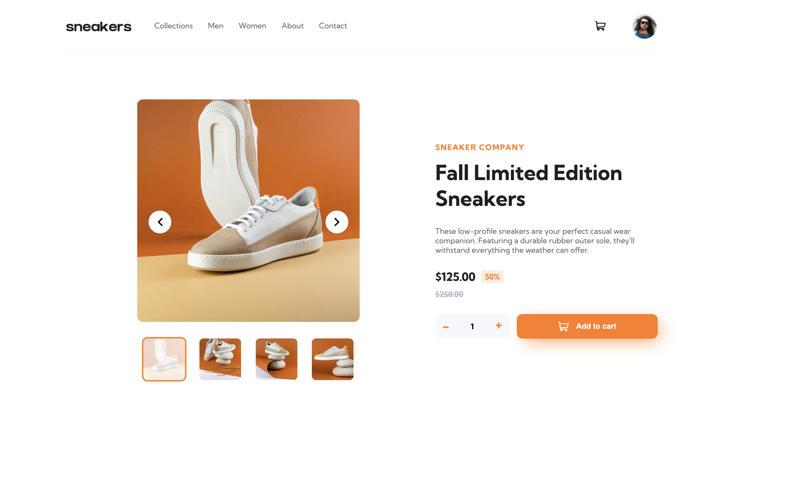

# Frontend Mentor - E-commerce product page solution

This is a solution to the [E-commerce product page challenge on Frontend Mentor](https://www.frontendmentor.io/challenges/ecommerce-product-page-UPsZ9MJp6). Frontend Mentor challenges help you improve your coding skills by building realistic projects.

## Table of contents

- [Overview](#overview)
  - [The challenge](#the-challenge)
  - [Screenshot](#screenshot)
  - [Links](#links)
- [My process](#my-process)

  - [Built with](#built-with)
  - [What I learned](#what-i-learned)
  - [Continued development](#continued-development)

- [Author](#author)

## Overview

### The challenge

Users should be able to:

- View the optimal layout for the site depending on their device's screen size
- See hover states for all interactive elements on the page
- Open a lightbox gallery by clicking on the large product image
- Switch the large product image by clicking on the small thumbnail images
- Add items to the cart
- View the cart and remove items from it

### Screenshot

### Links

- Solution URL: [Github Repo](https://github.com/alwinvankuijk/ecommerce-product-page)
- Live Site URL: [Live Demo](https://alwinvankuijk.github.io/ecommerce-product-page/)

## My process

### Built with

- TypeScript
- [Zustand](https://zustand-demo.pmnd.rs/)
- [React](https://reactjs.org/)
- [SCSS](https://sass-lang.com/)
- [Framer Motion](https://www.framer.com/motion/)

### What I learned

During the development of this project, I gained experience with a state management library (specifically Zustand). I discovered that utilizing Zustand was more convenient compared to prop drilling. Additionally, I experimented with Framer Motion to incorporate simple animations, which proved to be effective in animating elements that are conditionally rendered.

### Continued development

In my upcoming projects, I aim to enhance the architecture to ensure better organization and structure. Furthermore, I aspire to enhance the consistency of my SCSS code, as I haven't had extensive experience with it thus far.

## Author

- Frontend Mentor - [@alwinvankuijk](https://www.frontendmentor.io/profile/alwinvankuijk)
